**Выполнение работы** 

**Осуществление проверок и отчет по проверкам.**

Анализ Index.html сразу же выдает несколько секретов. Параметры integrity=”sha384-....” и crossorigin=”anonymous” id=root  как бы подталкивают на вектор атак из OWASP TOP10 [OWASP_2021_A05](https://www.zaproxy.org/alerttags/owasp_2021_a05)

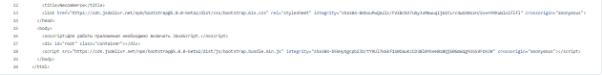

Само по себе использование протокола HTTP, а не HTTPS предполагает небезопасную передачу данных.    

Проверка кода Frontend и Backend производилась с помощью функционала Gitlab. Используя функционал были выстрены PipeLine проекта и проверен с помощью установленного настроенного Runer’ра. Поиск не дал  результатов.

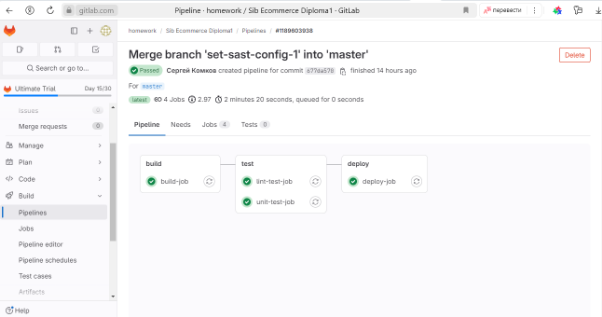

Так же сканирование SONARQUBE не дало результатов

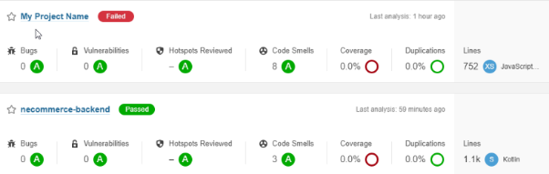

**Статический анализ фронтенда и бекенда**

Проект написано на языке Kotlin, файл robots.txt составлен корректно и не открывает лишней информации и доступов. 

Токен доступа для сессии хранится в локальном хранилище и доступен через JS, что дает возможность провести XSS -атаку.

` `**@GetMapping("/{id}")**

`    `**fun getById(@PathVariable id: Long) = service.getById(id)**   - здесь вероятно можно осуществить просмотр заказов без авторизации

**@DeleteMapping("/{id}")**

`    `**fun removeById(@PathVariable id: Long) = service.removeById(id)** - здесь вероятность удалить заказ без авторизации

**http**

`            `**?.cors()?.and()**

`            `**?.csrf()?.disable()**       -  отключены механизмы защиты от CORS и CSRF атак 

**в файле [necommerce-backend](https://github.com/netology-code/necommerce-backend/tree/master)/fcm.json** передаются чувствительные данные, которые могут быть использованы в социнженерии.

# **Анализ контейнеров**.
Настройка, сборка, и работа с контейнером ведется от одного root-пользователя, это недопустимо и описано в Docker CIS Benchmark’s. Это видно по Dockerfile и файлу конфигурации Nginx.

Кроме того, в логах запущенного контейнера в открытом виде передаются аргументы - логин и незашифрованный пароль

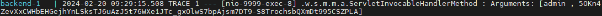

**Анализ зависимостей**

На Index.html, в логах, и файлах конфигурации NGinx неправильные настройки, которые предполагают проведение CORS CSRF и CLOUD METADATA атак. Об этом в алертах сообщает OWASP ZAP.  И сообщает об уязвимостях из списка OWASP TOP10

2017-A6 2021-A5 Security Misconfiguration 

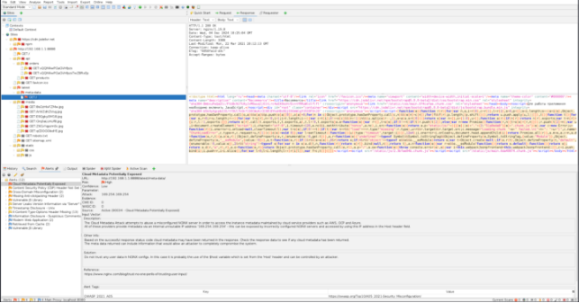

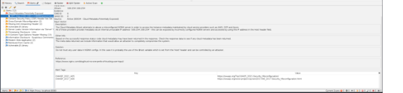

**Анализ функционирующего  приложения** 

При введение Login и password из лога открывается страница администратора 

Далее регистрируясь на платформе и заходя под  любым пользователем, есть возможность просматривать информацию о заказах других пользователей. То есть любой авторизованный пользователь может видеть персональные данные других пользователей. 

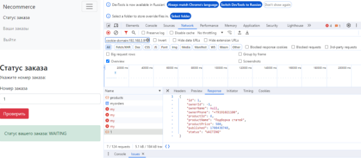

В локал сторэдже хранятся временные токены 

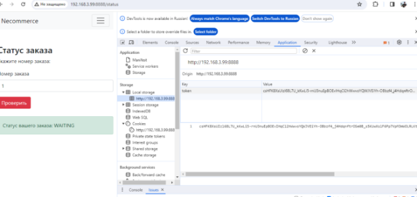 

При анализе сетевого трафика c помощью  WireShark никаких аномалий не выявлено.

Так же было произведено тестирование утилитой Nmap  на возможность проведения атак типа ARP-спуфинг  - проведение такого типа атак возможно. Кроме того на открытых портах 8888  и 9999 определяются версии приложений веб-серверов NGINX 1.19.8 и abyss-webserver

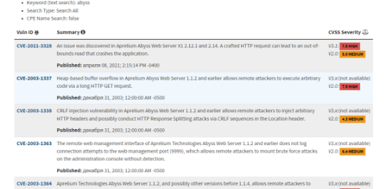

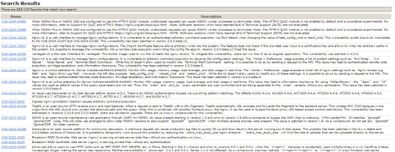

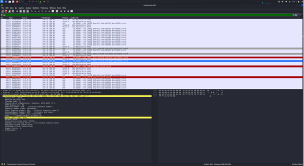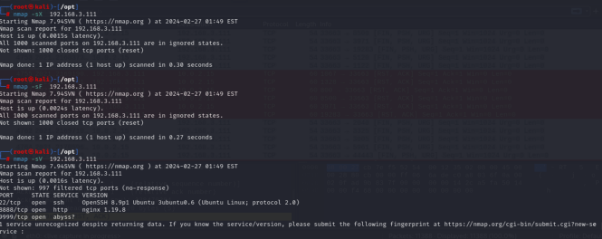

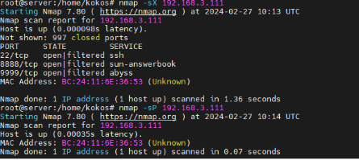c

При анализе hash сумм из  Index.html, которые используются для подтверждения бутстрапов, достоверно определить  соль в использовании алгоритма sha384, поэтому применим несколько известных утилите HashCat методов. Предполагаю, что это и есть просто хеш-суммы, не пароли зашифрованные. 

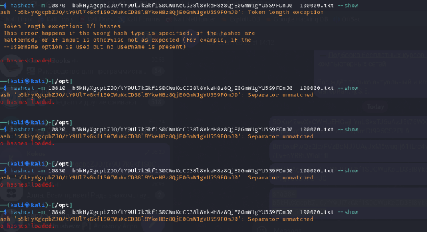

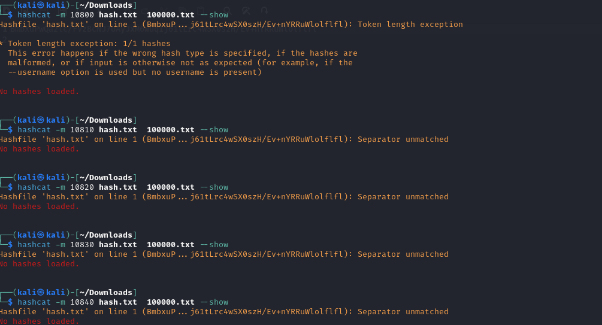

При атаке на пароли перебором в форме аутентификации возможно неограниченное количество попыток ввода пароля. Инструмент Intruder из приложения BurpSuite организует перебор неограниченное количество раз. 

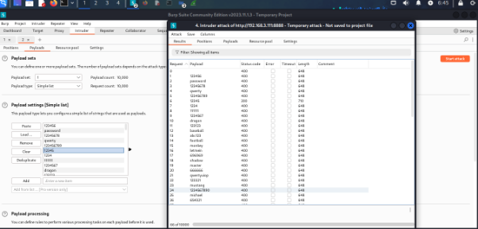

**Рекомендации по исправлению “Necommerce”**

- **Контейнеризация**:

  Настроить запуск приложений в контейнерах в соответствии с рекомендациями Docker CIS Benchmark.

- **Авторизация**:

  Устранить возможность просмотра заказов и удаления продуктов без авторизации.

- **Чувствительные** данные:

  Удалить закрытые ключи и другие данные из файлов конфигурации. Использовать переменные окружения.

- **CORS и CSRF**:

  Настроить соответствующие политики безопасности.

- **Генерация токенов**:

  Применить криптографически устойчивые алгоритмы.

- **Ограничение попыток ввода паролей**:

  Установить лимиты на количество неудачных попыток.

- **SSL/TLS**:

  Перейти на использование HTTPS для обеспечения безопасности передачи данных.

Все основные проблемы были выявлены путем анализа кода глазами, и тестов приложения в ручном режиме. Поэтому рекомендую  более тщательно подходить к Code Review

